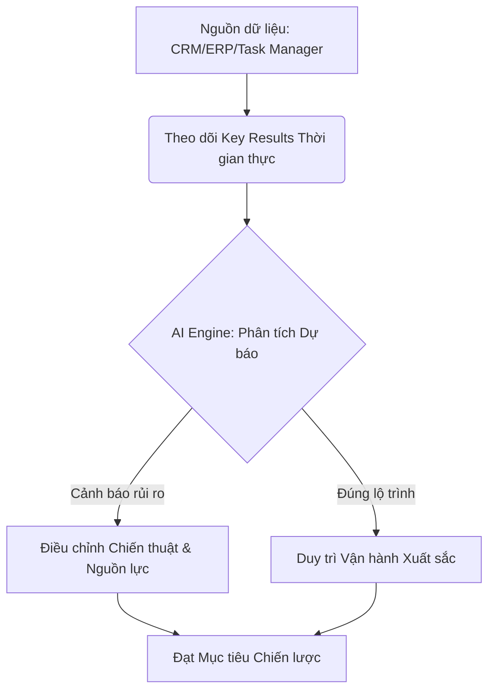

# Adaptive Strategy: Biến OKRs thành Động cơ Tăng trưởng bằng Predictive Analytics

Trong kỷ nguyên số, tốc độ không còn là một lợi thế cạnh tranh—nó là điều kiện để tồn tại. Tuy nhiên, một nghịch lý đang diễn ra: trong khi các doanh nghiệp có thể theo dõi doanh thu theo từng giây, thì quy trình quản trị chiến lược (Strategy Execution) vẫn thường bị kẹt trong những chu kỳ đánh giá quý chậm chạp. 

Tại sao 70% doanh nghiệp thất bại trong việc thực hiện chiến lược ngay cả khi họ đã áp dụng OKRs (Objectives and Key Results)? Câu trả lời nằm ở sự thiếu hụt khả năng **thích ứng dựa trên dự báo**.

## 1. Predictive OKRs: Khi dữ liệu nói về tương lai
Đa số chúng ta đang dùng OKRs như một chiếc gương chiếu hậu—để nhìn lại những gì đã xảy ra. Nhưng những nhà lãnh đạo tiên phong đang chuyển sang **Predictive OKRs**. 

Sự khác biệt cốt lõi nằm ở việc phân biệt giữa:
*   **Lagging Indicators (Chỉ số muộn):** Doanh thu cuối quý, số lượng khách hàng mới.
*   **Leading Indicators (Chỉ số dẫn dắt):** Tốc độ phản hồi lead, tỷ lệ hoàn thành các milestone kỹ thuật, hoặc chỉ số gắn kết của đội ngũ.

Bằng cách sử dụng **Predictive Analytics**, chúng ta không chỉ đo lường tiến độ hiện tại, mà còn dự báo được xác suất (Probability of Success) đạt mục tiêu trước khi chu kỳ kết thúc.

## 2. Mô hình vận hành Chiến lược Thích ứng
Để biến OKRs thành một động cơ tăng trưởng, doanh nghiệp cần xây dựng một hệ sinh thái dữ liệu khép kín. Dưới đây là quy trình phối hợp mà tôi đề xuất:

## 3. 3 Trụ cột để hiện thực hóa "Chiến lược Thích ứng"

### Trụ cột 1: Xây dựng dòng chảy dữ liệu sạch (Data Integrity)
Không có dự báo nào chính xác nếu dữ liệu đầu vào bị sai lệch hoặc có độ trễ. Bước đầu tiên không phải là chọn phần mềm OKRs đắt tiền, mà là kết nối các Key Results trực tiếp với các hệ thống vận hành (Single Source of Truth).

### Trụ cột 2: Từ "Đánh giá" sang "Huấn luyện" (Coaching Mindset)
Dữ liệu dự báo không dùng để trừng phạt. Nó là công cụ để quản lý (Manager) trở thành người huấn luyện (Coach). Nếu AI dự báo một KR chỉ có 30% khả năng hoàn thành, đó là lúc đội ngũ cần ngồi lại để tái phân bổ nguồn lực, thay vì đợi đến cuối quý để giải trình thất bại.

### Trụ cột 3: Sự linh hoạt trong thực thi (Dynamic Execution)
Một tổ chức mạnh là tổ chức dám từ bỏ những sáng kiến không còn hiệu quả ngay trong chu kỳ để tập trung vào những "điểm chạm" tạo ra giá trị lớn nhất.

## Kết luận
OKRs không nên là một bản danh sách kiểm tra (checklist) tĩnh lặng được mở ra mỗi 3 tháng. Nó phải là một **"Hệ điều hành Chiến lược" (Strategy OS)** sống động, được dẫn dắt bởi dữ liệu và định hướng bởi tầm nhìn.

Khi bạn kết hợp được tính kỷ luật của OKRs với sức mạnh dự báo của Data Analytics, bạn không chỉ đang quản trị mục tiêu—bạn đang tạo ra một tổ chức có khả năng tự thích ứng và phát triển vượt bậc.

---
**Bạn đã sẵn sàng để chuyển đổi hệ thống quản trị của mình sang mô hình Predictive chưa? Hãy kết nối với tôi để thảo luận sâu hơn về lộ trình triển khai phù hợp cho doanh nghiệp của bạn.**
